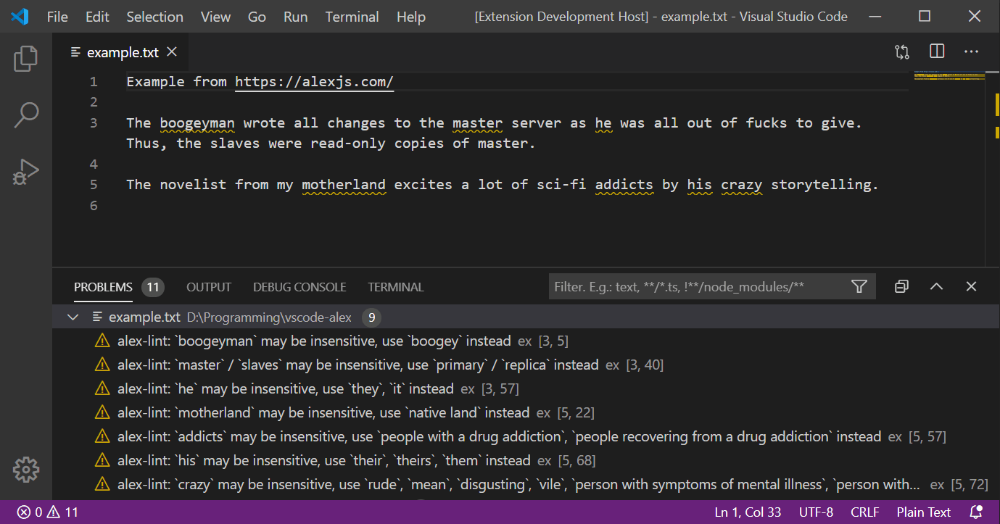

# vscode-alex

A [Visual Studio Code](https://code.visualstudio.com/) extension to find unequal phrasing in your text with [alex](https://alexjs.com/):

> Catch insensitive, inconsiderate writing.

## Installation

1. Run [`Install Extension`](https://code.visualstudio.com/docs/editor/extension-gallery#_install-an-extension) command from [Command Palette](https://code.visualstudio.com/Docs/editor/codebasics#_command-palette).
2. Search and choose `alex-linter`.

See the [extension installation guide](https://code.visualstudio.com/docs/editor/extension-gallery) for details.

## Usage

Enable alex-linter in the VS Code [settings](https://code.visualstudio.com/docs/getstarted/settings).

Then this extension automatically checks plain text files.

## Future features

* Add markdown support. This should in general be possible right now but the config and code must change.
* Add LaTeX support.
* Add list of problems to VS Code 'Problems' tab.

## License

Copyright (c) 2015 [Shinnosuke Watanabe](https://github.com/shinnn)
Copyright (c) 2020 [Tobias Lahmann](https://github.com/tlahmann)

Licensed under [the MIT License](./LICENSE).
